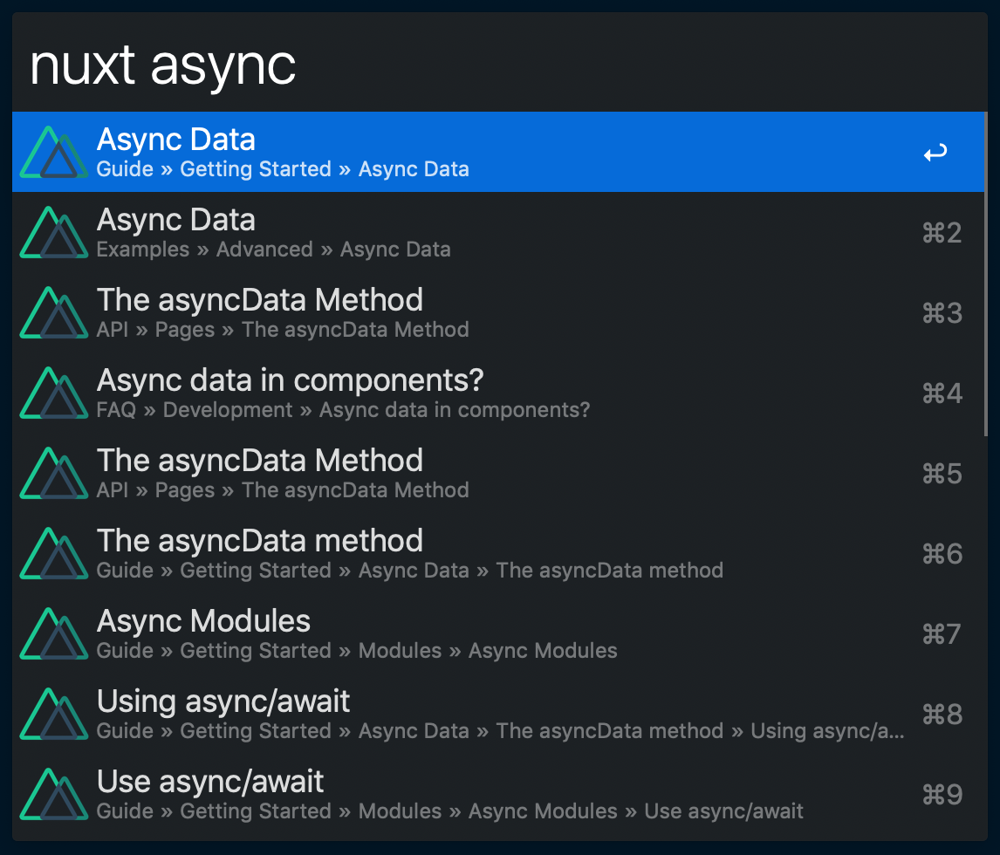

# Nuxt.js Docs Workflow for Alfred

An ultra-fast Nuxt.js docs search workflow for Alfred 3.

Adapted from [Alfred Laravel Docs](https://github.com/tillkruss/alfred-laravel-docs), Thanks [Till Krüss](https://twitter.com/tillkruss)!



## Installation

1. [Download the latest version](https://github.com/strebl/alfred-nuxt-docs/releases/download/0.1.0/Nuxt.js-Docs-0.1.0.alfredworkflow)
2. Install the workflow by double-clicking the `.alfredworkflow` file
3. You can add the workflow to a category, then click "Import" to finish importing. You'll now see the workflow listed in the left sidebar of your Workflows preferences pane.

## Usage

```
nuxt <query>
```

Just type `nuxt` followed by your search query.
